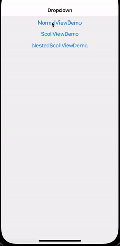

# @crosscement/react-native-dropdown

A simple and easy to use dropdown component.

[](https://www.npmjs.com/package/@crosscement/react-native-dropdown)

## Sample



## Installation

```sh
npm install @crosscement/react-native-dropdown
```

## Usage

```tsx
<Dropdown
  visible={visible}
  expand={
    <View style={{ height, backgroundColor: 'yellow' }}>
      <Button title="hide" onPress={hide} />
    </View>
  }
  onDismiss={hide}
>
  <Button title="show dynamic container" onPress={show} />
</Dropdown>
```

## License

MIT
