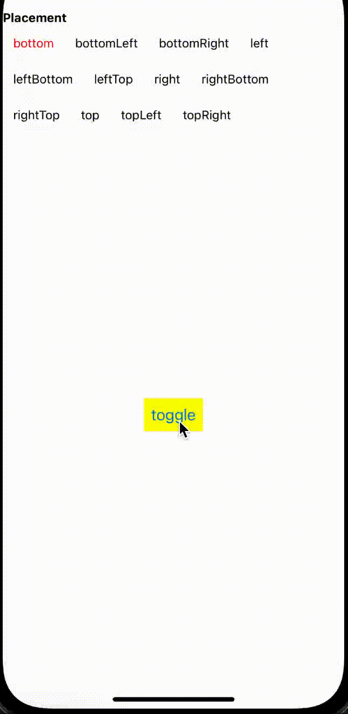

# @crosscement/react-native-tooltip

A simple and easy to use tooltip component.

[](https://www.npmjs.com/package/@crosscement/react-native-tooltip)

## Sample



## Installation

```sh
npm install @crosscement/react-native-tooltip
```

## Usage

```tsx
<Tooltip
  visible={visible}
  content={<Text>tooltip</Text>}
  placement="bottom"
  contentStyle={{
    maxWidth: 100,
  }}
>
  <Button title="toggle" onPress={() => setVisible(!visible)} />
</Tooltip>
```

## License

MIT
